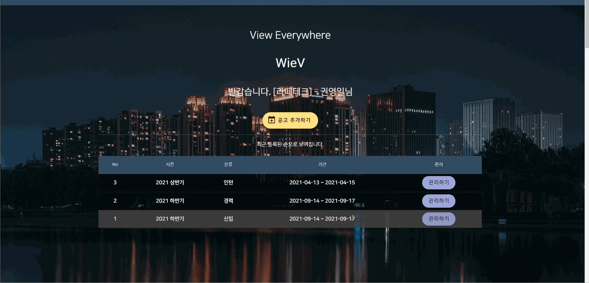
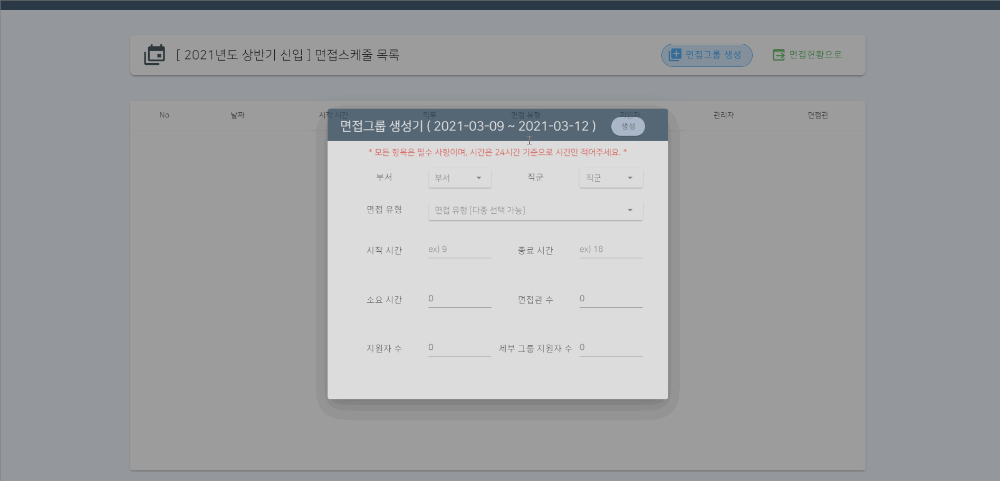
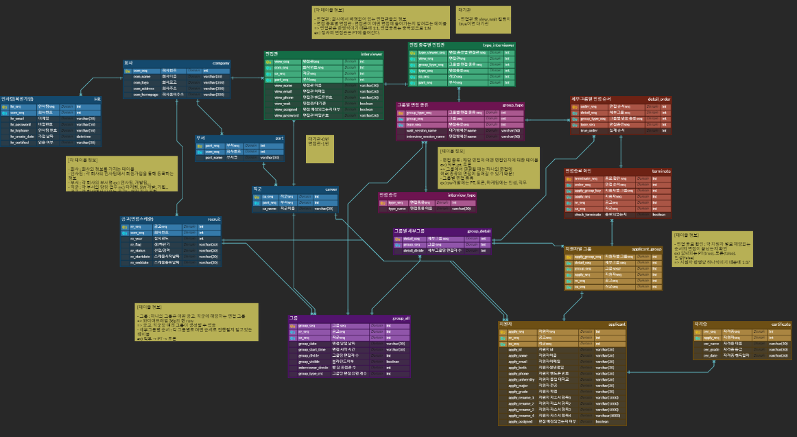
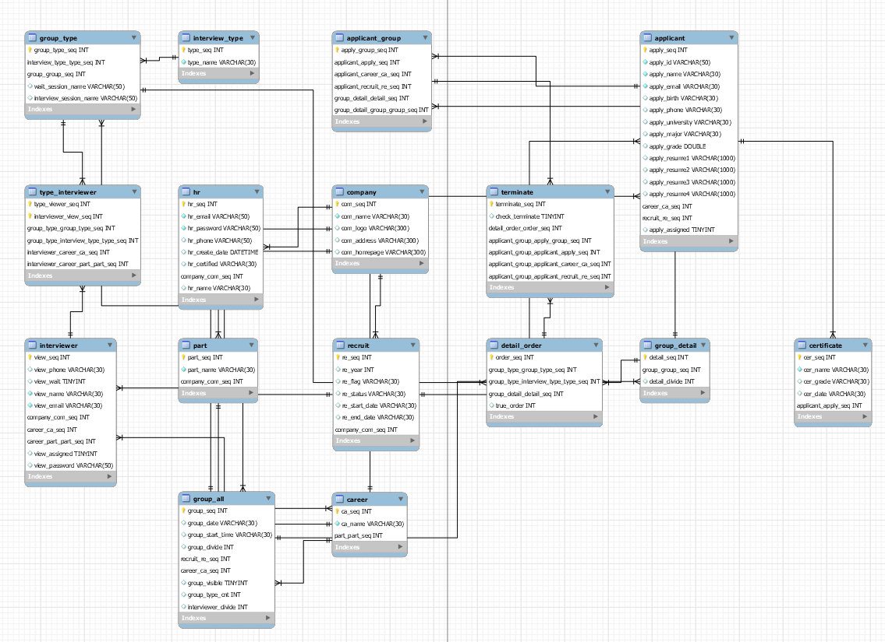

## <프로젝트 소개>

## [ 비대면 화상 면접 & 면접 관리 플랫폼 "WieV" ]

### > 실무자들이 면접의 목적인 지원자의 평가와 선발에 집중하기 위해 간편하고 효율적으로 사용할 수 있는 채용 및 면접 관리 플랫폼입니다.

#### 홈 화면


#### 면접 현황 및 생성





#### 데이터베이스






### 시연


#### 기술 스택


##### - Frontend 개발환경

- node v14.15.4
- npm 6.14.10
- yarn 1.22.5
- @vue/cli 4.5.10
- VScode Extensions
    - GitLab Workflow - GitLab
    - Vetur - Pine Wu
    - Vue 3 Snippets - hollowtree
    - HTML Snippets - Mohamed Abusaid
    - Live Server - Ritwick Dey
    - Visual Studio IntelliCode - Microsoft

###### Project setup
```
yarn install
```

###### Compiles and hot-reloads for development
```
yarn serve
```

###### Compiles and minifies for production
```
yarn build
```

###### Lints and fixes files
```
yarn lint
```

###### Customize configuration
See [Configuration Reference](https://cli.vuejs.org/config/).


##### - Backend 개발 환경

- Java jdk 13.0.1
    - [http://jdk.java.net/archive/](http://jdk.java.net/archive/)
- Apache Maven 3.6.3
    - [http://maven.apache.org/download.cgi](http://maven.apache.org/download.cgi) → apache-maven-3.6.3-bin.zip
- mySQL 8.0.22
- full distribution on Eclipse 4.15
    - [https://github.com/spring-projects/toolsuite-distribution/wiki/Spring-Tool-Suite-3](https://github.com/spring-projects/toolsuite-distribution/wiki/Spring-Tool-Suite-3)
    - STS 3.9.14.RELEASE
    - 디펜던시 : Spring Boot DevTools, Lombok, MyBatis Framework, MySQL Driver, Spring Web

##### - WebRTC

- openVidu [https://openvidu.io/](https://openvidu.io/)


